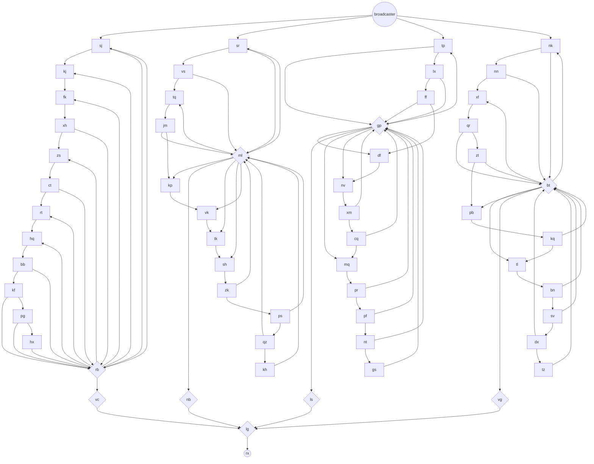

```mermaid
graph TD
    broadcaster((broadcaster)) --> sj[sj]
    broadcaster((broadcaster)) --> sr[sr]
    broadcaster((broadcaster)) --> tp[tp]
    broadcaster((broadcaster)) --> nk[nk]
    sj --> kj[kj]
    sj --> rb{rb}
    sr --> vs[vs]
    sr --> ml{ml}
    tp --> gp{gp}
    tp --> lx[lx]
    nk --> nn[nn]
    nk --> bt{bt}
    kj --> fk[fk]
    rb --> vc{vc}
    rb --> zs[zs]
    rb --> fk
    rb --> hq[hq]
    rb --> rt[rt]
    rb --> sj
    rb --> kj
    vs --> tq[tq]
    vs --> ml
    ml --> kp[kp]
    ml --> sr
    ml --> tq
    ml --> nb{nb}
    ml --> tk[tk]
    ml --> sh[sh]
    ml --> vk[vk]
    gp --> df[df]
    gp --> ls{ls}
    gp --> mq[mq]
    gp --> tp
    gp --> nv[nv]
    lx --> ff[ff]
    lx --> gp
    nn --> xf[xf]
    nn --> bt
    bt --> tl[tl]
    bt --> nk
    bt --> pb[pb]
    bt --> xf
    bt --> vg{vg}
    fk --> xh[xh]
    vc --> lg{lg}
    zs --> ct[ct]
    hq --> bb[bb]
    rt --> hq
    tq --> jm[jm]
    kp --> vk
    nb --> lg
    tk --> sh
    sh --> zk[zk]
    vk --> tk
    df --> nv
    ls --> lg
    mq --> pr[pr]
    nv --> xm[xm]
    ff --> gp
    ff --> df
    xf --> qr[qr]
    vg --> lg
    tl --> bn[bn]
    pb --> kq[kq]
    xh --> zs
    xh --> rb
    lg --> rx((rx))
    ct --> rt
    ct --> rb
    bb --> kf[kf]
    bb --> rb
    jm --> ml
    jm --> kp
    zk --> ml
    zk --> ps[ps]
    pr --> gp
    pr --> pf[pf]
    xm --> gp
    xm --> cq[cq]
    qr --> bt
    qr --> zt[zt]
    bn --> sv[sv]
    bn --> bt
    kq --> tl
    kq --> bt
    kf --> rb
    kf --> ph[pg]
    ps --> qz[qz]
    ps --> ml
    pf --> gp
    pf --> nt[nt]
    cq --> gp
    cq --> mq
    zt --> pb
    zt --> bt
    sv --> dx[dx]
    sv --> bt
    ph --> rb
    ph --> hx[hx]
    qz --> ml
    qz --> kh[kh]
    nt --> gs[gs]
    nt --> gp
    dx --> bt
    dx --> tz[tz]
    kh --> ml
    tz --> bt
    hx --> rb
    gs --> gp
```

